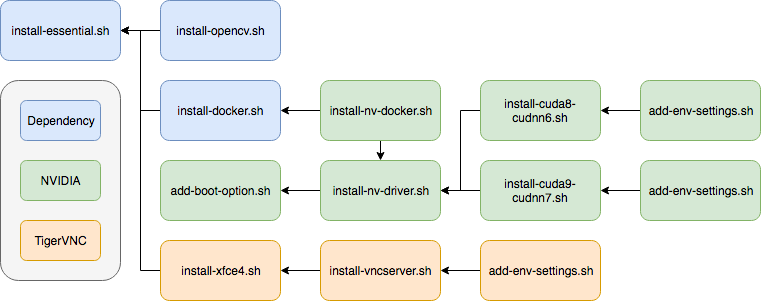
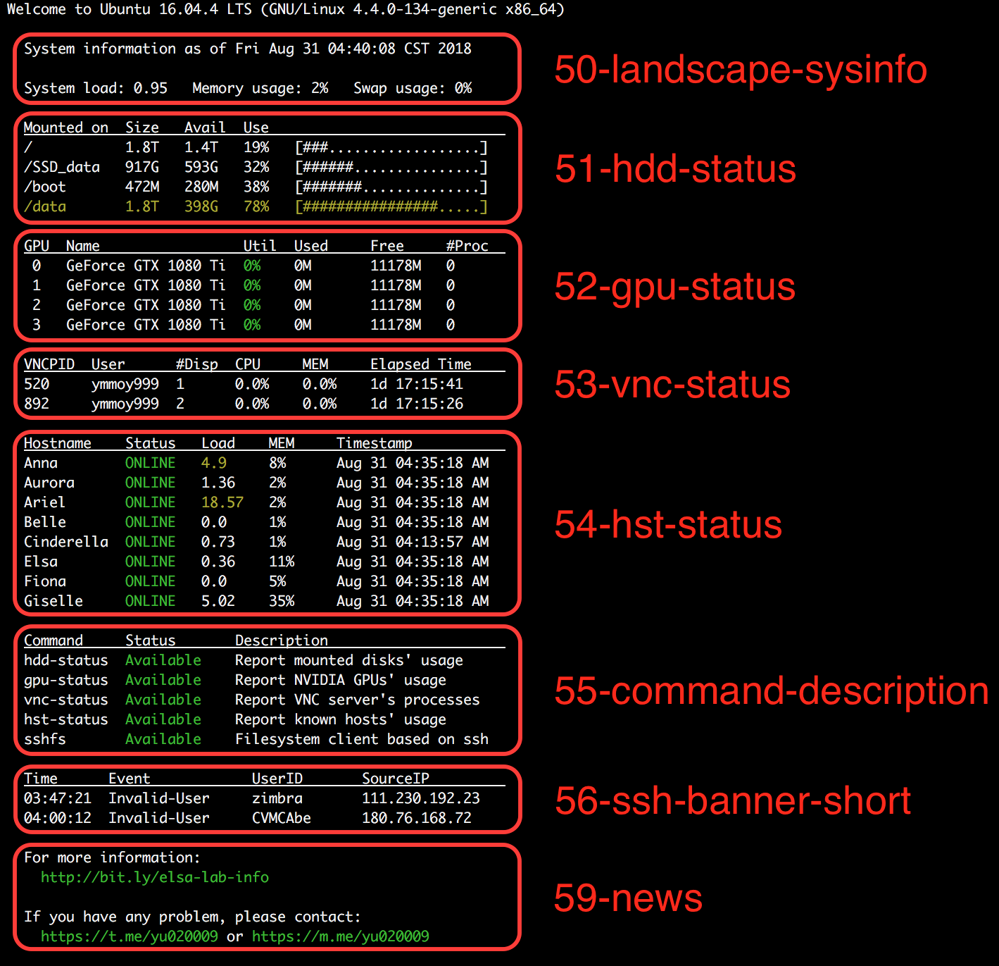

# Part I: Packages

# Part II: Services

## Basic System Information

Provide system info to other hosts.

## Hosts Monitor

for more information please link to the [repo](https://github.com/BassyKuo/hosts-monitor)

# Part III: MOTDs

