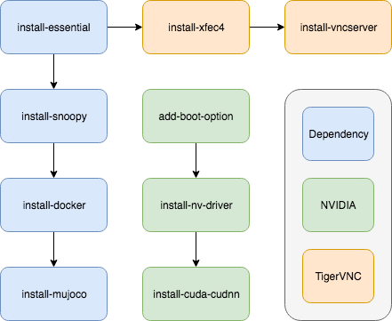
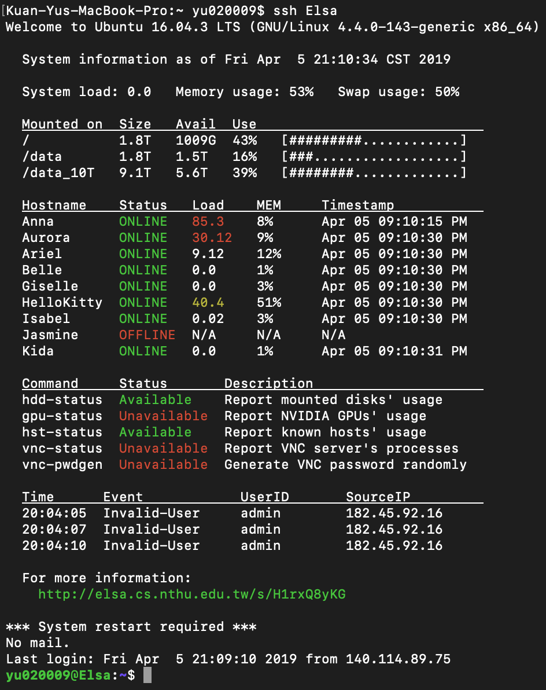

# Base-Env

A script package for server installation.

# Part I: Packages

# Part II: Services

### Basic System Information

provide system info to other hosts

### Hosts Monitor

for more details please link to the [repo](https://github.com/BassyKuo/hosts-monitor)

# Part III: MOTDs

