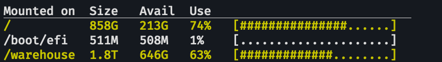
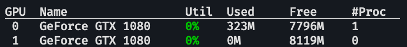
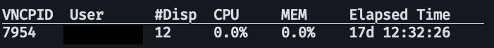
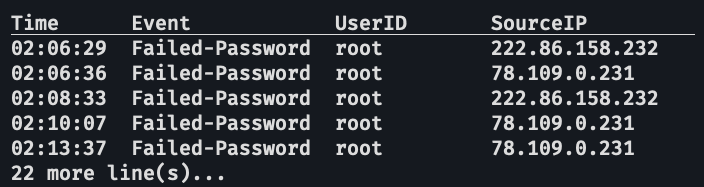
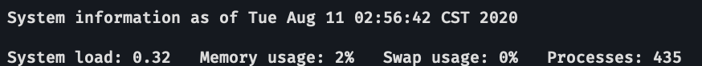

# Useful Commands

In this guide, we will introduce some customized command for ELSA Lab's computational environment.

# Check Disk Usage

To the check the disk usage of the system, enter the following command:
```bash
$ hdd-status
```
This command will return a table that specifies, for each of the partition mounted on the system, the
1. Mount point(`Mounted on`)

2. Total capacity(`Size`) 

3. Free space(`Avail`),

4. Used percentage(`Use`)  

The image below is an example of the returned table on one of ELSA Lab's server.
<div style="text-align:center"></div>

# Check GPU Usage

To check the gpu status of the system, please use this command:
```bash
$ gpu-status
```
This command will return a table that specifies, for each NVIDIA GPU installed on the system, the
1. Identification number(`GPU`)

2. Model Name(`Name`)

3. Current utilization(`Util`)

4. Allocated RAM space(`Used`)

5. Unallocated RAM space(`Free`)

6. Number of processes running on the GPU(`#Proc`)

The image below is an example of the returned table on one of ELSA Lab's server.

<div style="text-align:center"></div>

p.s. For more detail, please use the `nvidia-smi` command.

# Check VNC Server Usage

To check the status and information of all running VNC server, please use this command:
```bash
$ vnc-status
```
This command will return a table that specifies, for each running VNC process, the
1. Process Identification number(`VNCPID`)

2. User that create the VNC service(`User`)

3. Port number the VNC service is using(`#Disp`)

4. CPU load incurred(`CPU`)

5. Memory load incurred(`MEM`)

6. Time elapsed since the service was created(`Elapsed Time`)

The image below is an example of the returned table on one of ELSA Lab's server.


<div style="text-align:center"></div>

**You can find out more about VNC server [here](vnc-server.md)**
# Check if server is offline

If you have difficulties connecting to one of our servers, you can log in to the other servers and enter the following command:
```bash
$ ls-hosts
```

This command will return a list of names of the servers owned by ELSA Lab. If a server is offline or not functional at the moment, its name will appear in <font color=red>red</font>. 

# Switch CUDA version

To switch version of CUDA, please use the following command:

```bash 
$ chcuda CUDA_VERSION
```
Please replace `CUDA_VERSION` with the CUDA release that fits you needs. Please check [here](./installed-pkg.md#cuda-and-corresponding-cudnn-packages) for the list of supported CUDA versions and their corresponding cuDNN versions. Also, some cuda related environmental variable can be found [here](./env-vars.md#cuda-related-variables)

# Check Recently Banned IPs

To check what are the recently banned IPs, please use the command:
```bash
$ ssh-banner-short
```
This command will return, for each of the three most recent banning events, the
1. Time of the ban(`Time`)

2. Reason of the ban(`Event`)

3. User ID that tries to login(`ID`)

4. IP address from which the attempt originate(`SourceIP`)

The image below is an example of the returned table of the command `ssh-banner-short`:

<div style="text-align:center"></div>

**Reminder: if you enter your password incorrectly three times in one ssh connection request, and you are not under NTHU IP address(140.114.XXX.XXX), your IP address will be banned by our server. <font color=red>If you have your IP address banned by accident, pleas contact our IT personnel.</font>**


# Check System Load And Memory Usage Quickly

To have a quick look at the load and the memory usage of the system, please use the following command:
```bash
$ landscape-sysinfo
```
This command will return a brief report of the systems status, including the 
1. Current time

2. System load(`System load`)

3. Memory usage(`Memory usage`)

4. Swap space usage(`Swap usage`)

5. Number of processes(`Processes`)

The image below is an example of the result of running the `landscape-sysinfo` command:

<div style="text-align:center"></div>

**Do remember that this is only a brief summary of the system's status, for more detailed information, please use the command mentioned above**


