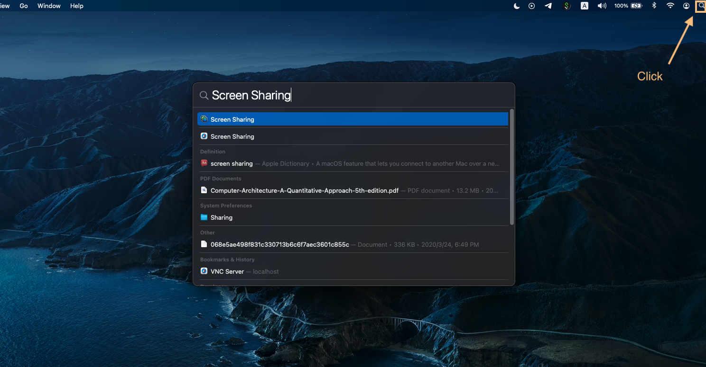
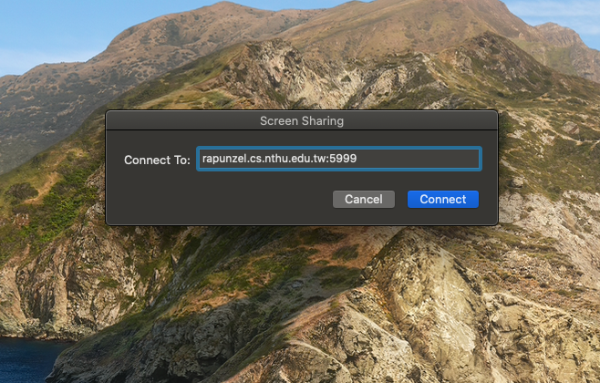
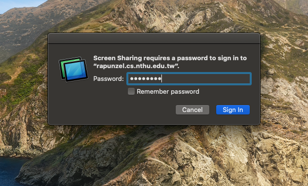
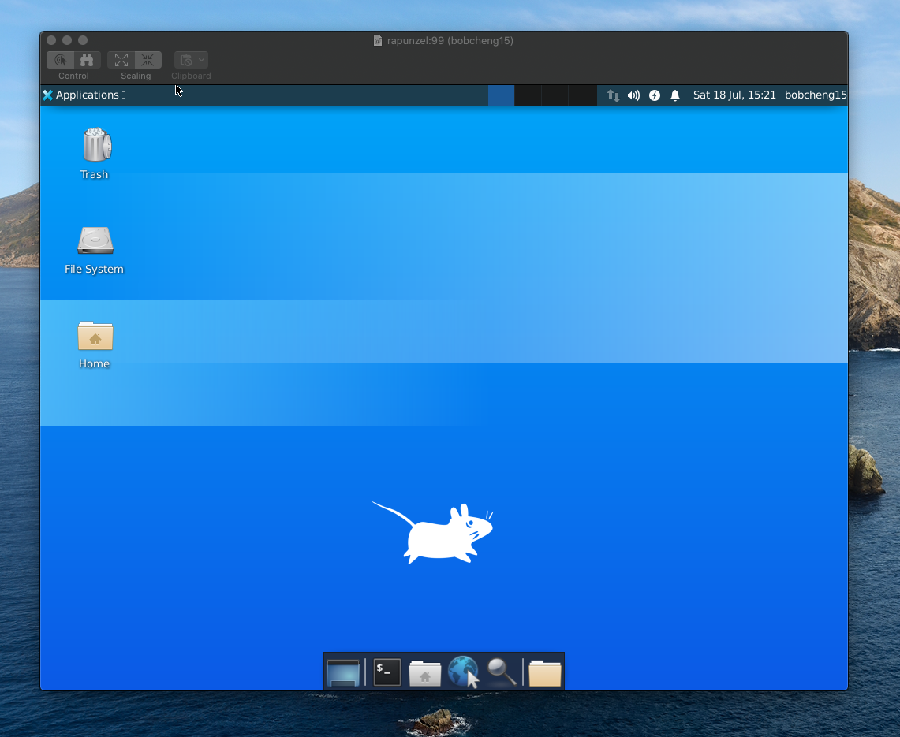
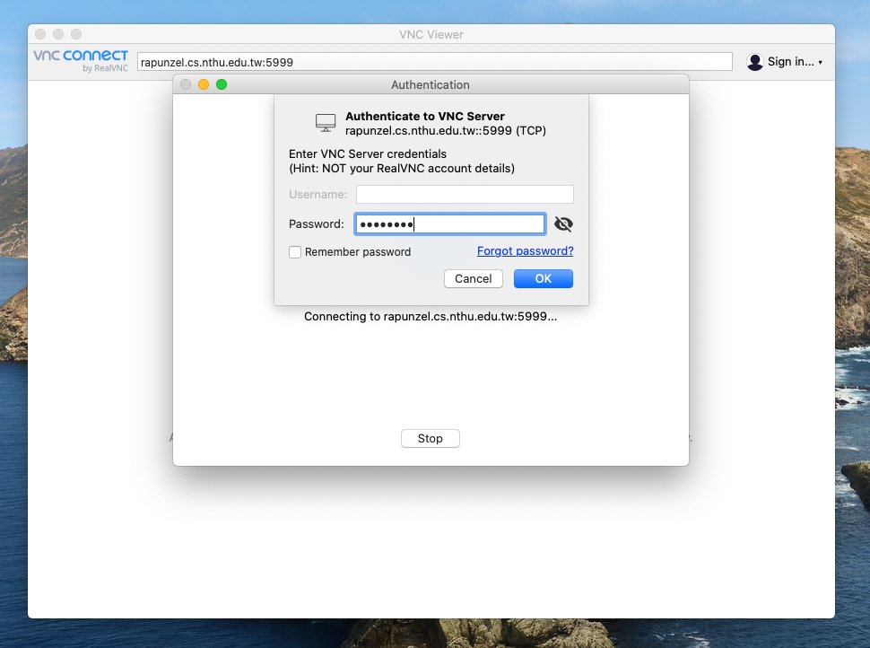
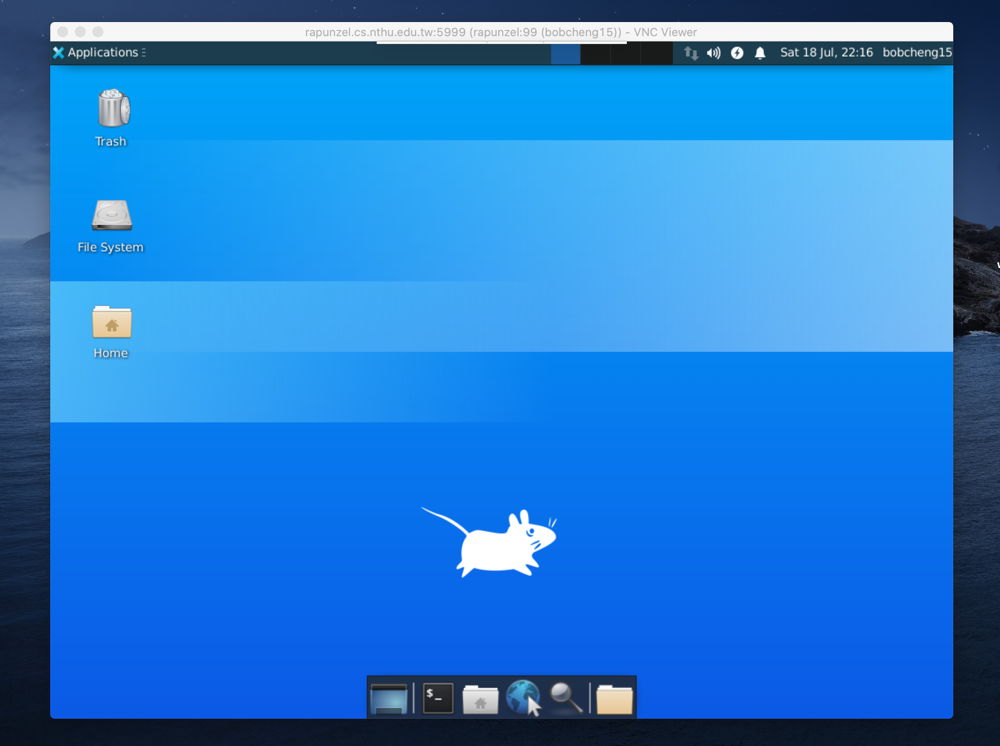

# VNC Server
In this guide, we will explain the procedure to remotely access servers' desktop environment on your own computer. 


# Server Setup

1. Start VNC server

    Start the VNC server on the workstation by typing the following command on the server.
    ```bash
    $ vncserver :X
    ```
    Change `X` to the port you want to use.

    **Pleasse do remember to add 5900 to `X` when you connect to the VNC server**.

2. Generate a random password 

    Enter the following command on the server.
    ```bash
    $ vnc-pwdgen
    ```
    This will generate a random password for connecting to the server in later steps. Be sure to copy this password to your clipboard for later.
    ```bash
    USERNAME@HOSTNAME $ vnc-pwdgen
    Random Generated VNC Password: IOxPyQYL
    # For example, the password generated here is IOxPyQYL,
    # which consists of only 8 characters.
    ```
    The setup procedure of the server is completed after this setup. Next, you can configure your computer to receive forwarded desktop environment.

# Client Setup
The steps to setup the client environment is different for macOS and Windows, so they will be introduced separately.

## macOS 

1. Open **Screen Sharing**

    On your computer, hit <kbd>⌘</kbd>+ <kbd>space</kbd> to open Spotlight Search. And type in "Screen Sharing" and hit <kbd>Enter</kbd> to open the built-in screen sharing app.
    
    <div style="text-align:center"></div>

2. Connect to Server

    Type in the server's host name followed by a colon and the port number(5900 + `X`). For example:

    <div style="text-align:center"></div>

    **The port should be the number `X` you specified in the VNC server creation step plus 5900.**

3. Enter Password

    After hitting the "connect" button, you will be prompted to enter the connection password. Please copy and paste the random password generated in the second step of server setup. Then hit enter.
        <div style="text-align:center"></div>

4. Done

    The desktop should appear, you will now be able to operate the server with its desktop environment.
    <div style="text-align:center"></div>

## Windows

1. Download VNC Viewer

    Download VNC Viewer installer for windows [here](https://www.realvnc.com/en/connect/download/viewer/windows/), and follow the installation wizard to complete the installation process.

2. Connect to Server

    Launch the VNC Viewer app. Enter the server's host name followed by a colon and the port number(5900 + `X`). For example:

    <div style="text-align:center"></div>

    **The port should be the number `X` you specified in the VNC server creation step plus 5900.**

3. Enter Password

    After you hit <kbd>Enter</kbd>, you will be prompt to enter the connection password. (if the app pops up warnings about unsecured connection, ignore it by clicking "continue"). Please copy and paste the random password generated in the second step of server setup. Then hit <kbd>Enter</kbd>. 
    
    <div style="text-align:center"></div>

4. Done

    The desktop should appear, you will now be able to operate the server with its desktop environment. Color of the screen may looks a bit odd initially, but it should return to normal in a short period of time. 

    <div style="text-align:center"></div>

# Kill the VNC server process
Once you are done, **<font color=red>please do remember to kill the VNC server process you created</font>** by using the following command:
```bash
$ vncserver -kill :X
```
**`X` is the number you used when starting the VNC server. That is, number before the addition of 5900.**

